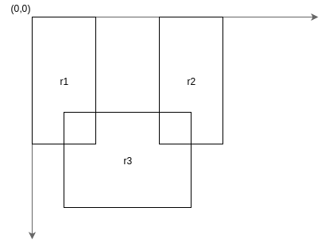

# Rectangles

There are multiple ways in which we can model a rectangle in programming. Here are two models:


In the first model we store the `(x, y)` pair where the rectangle starts and its `width` and `height`. A 
Javascript objet might look like this:
```javascript
{
    x: 20,
    y: 10,
    width: 100,
    height: 200
}
```

In the second model we consider the coordinates of two opposite corners of the rectangle. We can see that:
`x2 == x + width` and `y2 == y + height` so the two models are equivalent but, for certain operations it is
more convenient to store the corners instead of one corner, width and height:
```javascript
{
    x1: 20,
    y1: 10,
    x2: 120,
    y2: 210
}
```
We can take this a step further and consider each component of the rectangle as a separate object. 
The second model clearly contains two points so we can write each of them as an `{ x: ..., y: ... }` object:
```javascript
{
    start: {
        x: 20,
        y: 10
    },
    end: {
        x: 120,
        y: 210
    }
}
```

## #1
Write a function `rectangle(x, y, w, h)` that returns rectangle objects, using one of the models above. 
Depending on the model you choose, you may need to convert the arguments to the internal representation.

## #2
Create a list (an array) of 1000 rectangles. Use `Math.random()` to generate the parameters of the rectangles.
>`Math.random()` returns a random nubmer between `0` and `1`. We can use it to generate numbers in any range we 
like by multiplying the result with an integer. *E.g.: 0 &ge; `Math.random() * 100 ` &ge; 100.*

## #3
Find the rectangle that has the largest area. To make things easier, you can implement a method for computing 
the area that would work like this:
```javascript
var r = rectangle(0,0,10,20);
console.log(r.area()); 
// 200
```

## #4
Find the rectang;e that has the largest perimeter. You can use the same approach as #3. Print a message if
the rectangle with the greatest area is the same as the rectangle with the greatest perimeter.

## #5
Determine if two rectangles intersect. This should be a method on the rectangle that should be used like this:
```javascript
var r1 = rectangle(0, 0, 10, 20);
var r2 = rectangle(20, 0, 10, 20);
var r3 = rectangle(5, 15, 20, 15);
```



```javascript
r1.intersects(r2); // false
r2.intersects(r3); // false
r1.intersects(r3); // true
r3.interects(r2); // true
```

## #6
Find all the rectangles in the list from #2 that do not intersect with other rectangles.

Good luck!